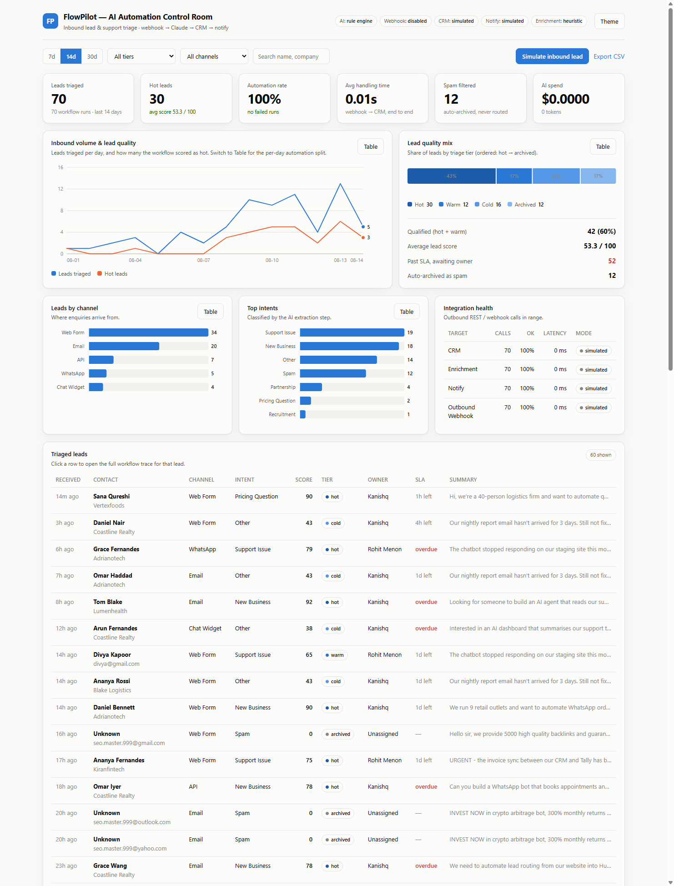
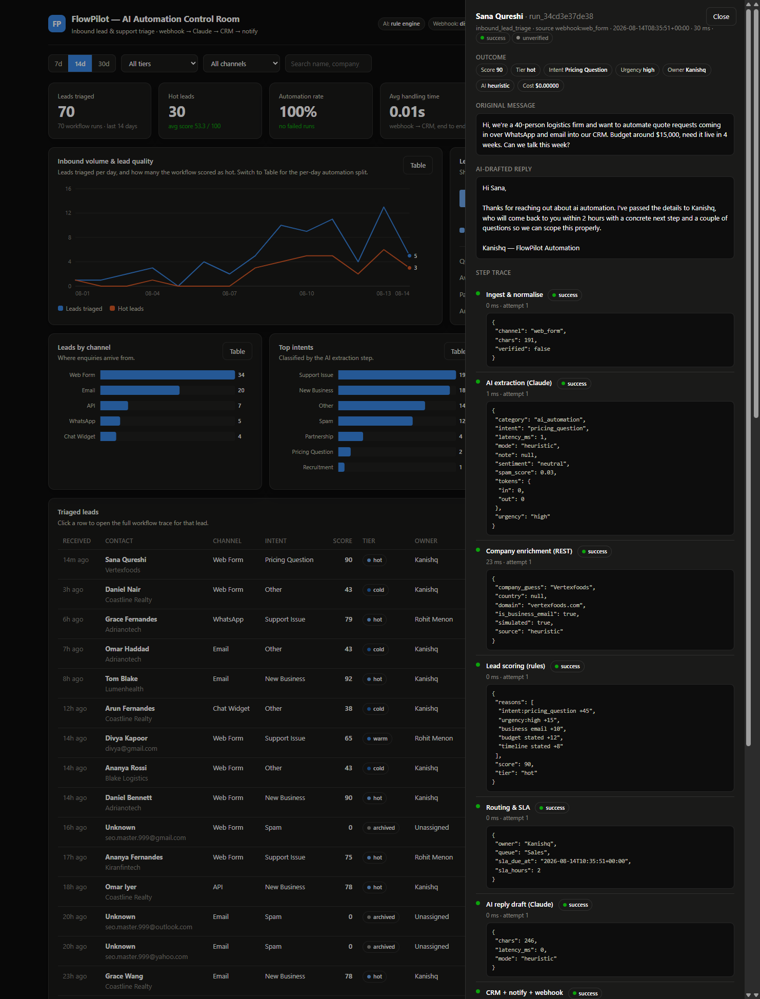

# FlowPilot — AI Automation Suite

An inbound **lead & support triage** automation: a signed webhook lands a message from any
channel, Claude extracts and classifies it, deterministic rules score and route it, an AI
reply is drafted, and the result is pushed to a CRM, a notification channel and a signed
outbound webhook — with every step traced and replayable from a live dashboard.

Built as the practical technical test for the **AI Automation Developer** role at I Vision
Infotech. Deliverable-by-deliverable mapping is in [SUBMISSION.md](SUBMISSION.md).

**New here?** [docs/WHAT_IT_DOES.md](docs/WHAT_IT_DOES.md) explains the problem, the use case and
a worked example in plain language — no code.



---

## The workflow

```
POST /webhook/inbound   (HMAC-SHA256 verified, replay-protected)
        │
        ├─ 1  ingest       normalise any channel into one shape, reject empty payloads
        ├─ 2  ai_extract    Claude → strict JSON: intent, category, urgency, sentiment,
        │                   spam score, contact details, budget, timeline, summary
        ├─ 3  enrich        REST company lookup from the email domain          (optional)
        ├─ 4  score         deterministic 0–100 lead score + hot/warm/cold/archived
        ├─ 5  route         queue, owner and an SLA deadline from the tier
        ├─ 6  ai_reply      Claude drafts the first response                   (optional)
        └─ 7  deliver       CRM upsert (REST) + notification + signed webhook  (optional)
                            ↓
                  SQLite: leads, runs, run_steps, deliveries  →  dashboard
```

**Why the AI/rules split.** Claude does what rules are bad at — reading intent out of messy
human text. Scoring, routing and SLAs stay in plain Python because a client needs those to be
auditable and identical on every run. The dashboard shows the score's reasoning line by line.

**Failure is designed for.** Steps marked *optional* degrade the run to `partial` instead of
failing it: if Slack is down, the lead is still captured, scored and stored. Every step has its
own retry budget, and every attempt is timed and persisted.

**It runs with no keys.** Without `ANTHROPIC_API_KEY` the AI step falls back to a deterministic
rule engine; without integration URLs the outbound calls are simulated and labelled as such in
the UI. That is also the automatic fallback path if a live Claude call errors mid-run — so a
reviewer can clone this and see the whole thing work in 30 seconds, offline.

---

## Quick start

```bash
pip install -r requirements.txt

python scripts/seed_demo.py --reset       # 70 realistic runs across 14 days
python run.py                             # dashboard on http://127.0.0.1:5000
```

Then, in a second terminal:

```bash
python scripts/send_test_webhook.py               # a correctly signed inbound lead
python scripts/send_test_webhook.py --tamper      # modified after signing -> HTTP 401
```

Optional — go live one layer at a time by copying `.env.example` to `.env` (never edit
`.env.example` itself; it is the only env file git tracks):

| Set this | Turns on |
|---|---|
| `ANTHROPIC_API_KEY` | real Claude extraction + reply drafting (`claude-opus-5`) |
| `WEBHOOK_SECRET` | signature enforcement on the inbound webhook (401 without a valid one) |
| `CRM_BASE_URL`, `CRM_API_KEY` | real REST CRM upsert |
| `NOTIFY_WEBHOOK_URL` | real Slack / Discord / Teams notification |
| `OUTBOUND_WEBHOOK_URL`, `OUTBOUND_SECRET` | signed event fan-out to your own systems |
| `ENRICHMENT_URL` | real company-enrichment API |

`python scripts/mock_crm_server.py` gives you a real REST endpoint on `127.0.0.1:5055` for all
three outbound integrations, including HMAC verification of the outbound webhook — so the live
path can be demonstrated without any third-party account.

---

## The dashboard

- Six KPI tiles: leads triaged, hot leads, automation rate, average end-to-end handling time,
  spam filtered, AI spend (tokens × list price).
- Inbound volume vs. hot leads over time, lead-quality mix, leads by channel, top intents,
  and per-integration health (calls, success rate, latency, live vs simulated).
- A lead table with tier/channel/search filters; clicking a row opens the **full workflow
  trace** — every step with status, duration, retry count and raw output, the original message,
  the AI-drafted reply, the outbound calls, and a **Replay** button that re-runs the stored
  payload through the current workflow definition.
- Charts are hand-rolled SVG — no chart library, no CDN, nothing loaded from the network.
  Light and dark are both explicitly designed; every chart has a table view for accessibility;
  the categorical and ordinal palettes were validated for colour-vision deficiency and contrast
  against both surfaces.



**Live demo (no install):**
https://kanishqtanwar35-hub.github.io/flowpilot-ai-automation/demo.html

That page is generated by `python scripts/build_static_demo.py`, which freezes the running
dashboard — real stats, leads and full run traces — into one self-contained file
(`docs/demo.html`) with a `fetch` shim in place of the backend. Filters, table views and the
workflow trace all still work; host it on GitHub Pages if you'd rather own the link.

---

## API surface

| Method | Path | Purpose |
|---|---|---|
| `POST` | `/webhook/inbound` | signed inbound message → runs the workflow, returns the triage result |
| `GET` | `/webhook/health` | signing mode + skew window |
| `GET` | `/api/stats?days=N` | KPIs, daily series, breakdowns, integration health |
| `GET` | `/api/leads?tier=&channel=&q=&limit=` | filtered lead list |
| `GET` | `/api/leads/<id>` | one lead + its run |
| `GET` | `/api/runs`, `/api/runs/<id>` | run list / full step trace + deliveries |
| `POST` | `/api/runs/<id>/replay` | re-run a stored payload |
| `POST` | `/api/demo/simulate` | fire a sample message through the workflow |
| `GET` | `/api/export.csv` | all leads as CSV |
| `GET` | `/api/health` | which layers are live vs simulated |

### Webhook signature

```
X-FlowPilot-Timestamp: 1755100000
X-FlowPilot-Signature: sha256=<hmac_sha256(secret, "<timestamp>." + raw_body)>
```

The timestamp is inside the MAC and is rejected outside ±300s, so a captured request cannot be
replayed later; comparison is constant-time. The same scheme is used for outbound webhooks, and
`scripts/mock_crm_server.py` verifies it on receipt.

---

## Secrets

Full write-up: **[docs/SECURITY.md](docs/SECURITY.md)**. The short version:

```bash
python scripts/scan_secrets.py --install-hook   # once, right after git init
```

- `.env`, `.env.*`, `*.pem`, `*.key`, `credentials.json` are gitignored (`.env.example` is not).
- A **pre-commit hook** blocks the commit if a secret file is staged, is already tracked, or a
  token-shaped string appears in staged content.
- At runtime, everything written to the database, returned by the API, rendered in a trace,
  logged, or baked into the static demo passes through `redact()` first — two layers: the
  literal value of every configured secret, plus known token shapes (`sk-ant-…`, `Bearer …`,
  Slack/Discord webhook URLs, …).
- Credential-bearing URLs are stored via `safe_url()`: `https://hooks.slack.com/services/…`.
- The dashboard and `/api/health` report **modes**, never values.

Verified end to end: with an intentionally invalid key loaded, the live `401` from Anthropic is
caught, the run completes on the fallback engine, and the stored trace contains no key material.

## Tests

```bash
python -m pytest -q        # 33 tests
```

Covers the happy path end to end, spam archiving, support routing, fail-fast on an empty
payload, deterministic replay, per-step retry/degradation, all five webhook rejection cases,
the Claude request shape and cost accounting (against a stub SDK client), automatic fallback on
refusal/transport failure, the API response shapes, and secret redaction — including the
realistic leak: an SDK error quoting the key, asserted absent from the database and the API.

---

## Layout

```
app/
  workflow.py      the engine + the seven steps + scoring/routing rules
  ai.py            Claude client (strict JSON schema) + heuristic fallback engine
  integrations.py  outbound REST/webhooks: retries, HMAC signing, delivery audit
  webhooks.py      inbound receiver + signature verification
  api.py           dashboard JSON API
  db.py            SQLite schema and queries
  security.py      secret redaction: the choke point every stored/logged string passes
  static/          styles.css · charts.js (hand-rolled SVG) · app.js
  templates/       dashboard.html
scripts/           seed_demo · send_test_webhook · mock_crm_server · build_static_demo · scan_secrets
tests/             32 pytest tests
docs/              WHAT_IT_DOES.md · ARCHITECTURE.md · CASE_STUDY.md · SECURITY.md
                   screenshots · demo.html (the self-contained live demo)
```

---

## Notes & limits

- SQLite + Flask's dev server are right for a demo, not for production traffic. The workflow
  engine is synchronous by design so the webhook response can carry the triage result; at real
  volume the `deliver` step belongs on a queue (see [docs/ARCHITECTURE.md](docs/ARCHITECTURE.md)).
- The Claude integration is written against the current Messages API (`claude-opus-5`, strict
  JSON schema via `output_config.format`, SDK-level retries) and is covered by tests using a
  stub client. It was **not** exercised against the live API in this environment, since no API
  key was available here — add a key and the same code path runs for real.
- Lead scoring weights are opinions, not truths. They live in one table at the top of
  `app/workflow.py` and are meant to be tuned per client.
